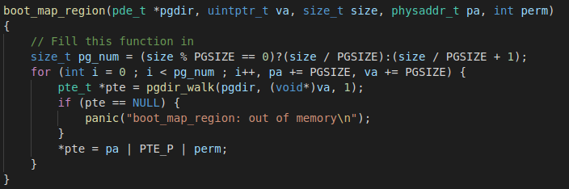
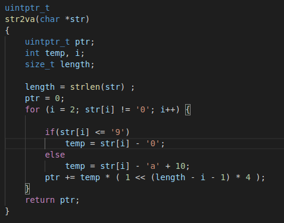

# OS Lab4 内存管理

2018级 信息安全 管箫 18307130012

## 代码实现

### 物理内存页管理

JOS内核首先调用i386_init()，此函数会调用mem_init()，而mem_init()通过调用我们将实现的函数来实现内核内存管理。

#### boot_alloc()
本函数维护了一个static指针nextfree，初始值指向符号值end，也即bss段末尾。
我们要实现的功能是：分配一块大小为传入参数n的物理内存空间，然后更新nextfree的值，使其指向下一处空闲内存地址。

#### mem_init()

接着，mem_init()函数分配内存空间，设置一个追踪全部Page的信息数组。然后调用page_init()对所有页面进行初始化。

#### page_init()

此函数对上一步生成的pages信息数组进行初始化，标记各页面属性，并且建立空闲页面链表。

其中，我们必须注意到，Page0被实模式IDT和BIOS占用，而IO_Hole也不可被用户使用，这两部分的页面必须被标记为已占用，并且不加入空闲页面链表中。

#### page_alloc()

此函数从空闲页面链表中取出一个PageInfo结构，然后根据传入参数决定是否初始化内存空间。

#### page_free()

此函数将传入的PageInfo结构重新放回空闲页面链表。

### 虚拟内存管理

这部分，我们通过实现页目录和页表的操作函数，实现从虚拟地址到物理地址的内存地址转换。

#### pgdir_walk()

函数传入参数为页目录的虚拟地址、查询的虚拟地址、布尔值，效果在于查询该虚拟地址所对应的页表条目。

如果页表项还没有分配，将会分配一个新的页面。

#### boot_map_region()

此函数映射[va, va+size)的虚拟空间到[pa, pa+size)的物理空间，通过逐个修改PTE完成。

同时设置映射后，必须更改权限位和标志位。

#### page_insert()

“增”操作。将给定的va映射到pp指定的物理空间，通过操作PTE实现。

#### page_lookup()

“查”操作，遍历页目录，返回传入va对应的页的PageInfo。

#### page_remove()

“删”操作，先查找va对应的PageInfo信息，如果存在，那么将其ref减少，清空其PTE并使TLB缓存无效化。

### 内核线性空间初始化

映射部分由内核所有的空间，包括pages数组、页目录和内核栈等。

### 地址映射展示

#### 工具函数

在kdebug.c中定义了一个工具函数，可以展示传入va对应的物理地址和页信息。页信息通过page_lookup()函数实现了查找，而物理地址则由page2pa完成从页信息到物理地址的转换。

#### 主体函数

函数的主体部分定义在monitor.c中，主体函数解析传入的参数，对单页面和页面范围分别进行处理。如果单页面则直接调用工具函数，多参数则作为页面范围，以0x1000作为默认页面大小，逐个调用工具函数。

#### 辅助函数

由于输入参数是十六进制格式的字符串化数字，而实际查询地址需要无符号整型格式的虚拟地址，此处编写了自定义函数对两者进行转换。

### 运行结果展示

#### make grade

#### showva2pa

##### single page

##### multi page

## 问题回答

### 程序中的地址从什么时候开始都是虚拟地址了，请找到那几行代码。

在entry.S中开启分页机制后，JOS代码将运行在虚拟地址下。

### mem_init()函数中kern_pgdir 的虚拟地址是多少？物理地址呢？在我们还未完成本次lab 之前，为什么我们已经可以使用虚拟地址了？
kern_pgdir的虚拟地址是0xef400000，物理地址是0x119000。因为JOS在开始执行时使用了“人工手写”的方式，将部分虚拟地址和物理地址使用硬编码的方式建立了映射。

### 哪一行代码使得本次lab 所构建的虚拟内存系统真正被使用？请指出它的位置。

从完成此处的init后，本次lab的分页机制建立，虚拟内存系统投入使用。

### 此操作系统可支持的最大物理内存是多少？为什么？

[UPAGES, UVPT)这段存储的是所有页的PageInfo结构，每一个物理页都要在其中有一个这样的结构，因此这段的大小实际上就决定了JOS操作系统最多能支持的物理内存大小。

inc/memlayout.h中指出这段的大小是PTSIZE，inc/mmu.h定义了它为PGSIZE * NPTENTRIES，再继续探查可知，这个值的大小为2^22 byte。另外，一个PageInfo结构的大小是8 byte（一个指针和一个32位整数），每个PageInfo结构对应着一个4 KB = 4096 byte的页面。

综上，最多能支持的物理内存为2^22 / 8 * 4096 = 2^31 byte = 2 GB。

### 请详细描述在JOS 中虚拟地址到物理地址的转换过程。

虚拟地址通过分段机制转换为线性地址，因为JOS中设置所有的段基址均为0，所以线性地址就等于虚拟地址。当处理器碰到一个线性地址后，它的MMU部件会把这个地址分成 3 部分，分别是页目录索引(Directory)、页表索引(Table)和页内偏移(Offset)， 这 3 个部分把原本 32 位的线性地址分成了 10+10+12 的 3 个片段。每个页表的大小为4KB（因为页内偏移为12位）。

举例：现在要将线性地址 0xf011294c 转换成物理地址。首先取高 10 位(页目录项偏移)即960(0x3c0)，中间 10 位(页表项偏移)为274(0x112)，偏移地址为1942(0x796)。首先，处理器通过 CR3 取得页目录，并取得其中的第 960 项页目录项，取得该页目录项的高 20 位地址，从而得到对应的页表物理页的首地址，再次取得页表中的第274项页表项，并进而取得该页表项的首地址，加上线性地址的低12位偏移地址1942，从而得到物理地址。

### 在函数pgdir_walk()的上下文中，请说明以下地址的含义，并指出他们是虚拟地址还是物理地址：

#### pgdir

pgdir的含义为页目录的虚拟地址

#### pgtab = PTE_ADDR(pgdir[PDX(va)])

va对应的页目录的物理地址

#### pg = PTE_ADDR(KADDR(pgtab)[PTX(va)])

va的页表项的物理地址

### 画出本次Lab 结束后虚拟地址空间与物理地址空间的映射关系，地址空间表示图中应至少包含kern_pgdir 与pages，展示越多的细节越好。（提示：地址空间的表示方式可以参考Lab 1-“The PC's Physical Address Space”小节）

(图片参考https://www.cnblogs.com/cindycindy/p/13524709.html)