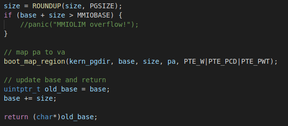
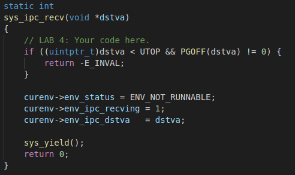

# OS Lab5 进程调度

2018级 信息安全 管箫 18307130012

## Part 1 Multiprocessor Support and Cooperative Multitasking

在第一部分中，我们将编写代码以使JOS能够运行在一个多处理器系统上，并且实现新的JOS内核系统调用去允许用户级别的环境创建新的环境。还需要实现协作式论询调度，允许内核当旧的用户环境自愿放弃CPU或退出时切换至一个新的用户环境。

### 多处理器支持

本部分中，我们需要使JOS支持“对称多处理”（Symmetric Multiprocessing），该模型下所有的CPU都有着对系统资源的平等访问权。

尽管在SMP下所有的CPU在功能上均等价，在启动时仍然分为两种类型——引导处理器（Bootstrap Processor或是BSP）负责初始化系统并且引导操作系统；应用处理器（Application Processors或是APs）仅在系统启动运行后被BSP激活。BSP处理器由硬件和BIOS决定，现有的代码已经运行在BSP上。

在SMP中，每一个CPU都有一个相伴的LAPIC（Local Advanced Programmable Interrupt Controller）单元。LAPIC单元负责在整个系统中传递中断。LAPIC为相连的CPU提供了一个唯一标识。

处理器通过内存映射IO（Memory-mapped I/O 或是MMIO）访问LAPIC。在MMIO中，一部分物理内存被硬连接至某些IO设备的寄存器。所以访问内存的`load/store`指令可以被用来访问设备寄存器。JOS中在ULIM之上，预留了4MB的内存空间来映射APIC的寄存器所以在使用APIC之前首先要完成映射。

#### Exercise 1

这一部分实现了MMIOBASE处的映射。

我们利用boot_map_region函数将该部分物理内存分配给MMIO。

### 应用处理器引导

BSP在引导APs之前首先收集多处理器系统的信息，`kern/mpconfig.c`中的`mp_init()`函数通过读取BIOS内存中的MP配置表获取相应的信息。

在`kern/init.c`中的`boot_aps()`函数驱动AP引导过程。APs在实模式中启动，所以`boot_aps()`从`kern/mpentry.S`中拷贝AP入口代码到一个实模式可寻址的位置。在本实验中，将入口代码拷贝至`0x7000`（*MPENTRY_PADDR*）。

#### Exercise 2

将MPENTRY_PADDR处的物理页表标识为已用，防止其作为空闲页被分配。

### 处理器状态初始化

在多核处理器中，每个核独有的变量有：

1. 内核栈。`percpu_kstacks[NCPU][KSTKSIZE]`为`NCPU`个内核栈预留空间。CPU 0的栈将从KSTACKTOP开始向下增长；CPU 1的栈将从CPU 0栈下方间隔KSTKGAP处开始增长。

2. TSS描述符。CPU i的TSS被存储于`cpus[i].cpu_ts`中，相应的TSS描述符在GDT入口`gdt[(GD_TSS0 >> 3) + i]`处被定义。

3. 每个核的当前执行的环境。

4. 每个核的寄存器。包括系统寄存器在内的所有寄存器都属于各CPU私有。因此初始化这些寄存器的指令如`lcr3`, `ltr`等，必须在每个CPU上都被执行。

#### Exercise 3

为每个核都分配一个内核栈。

#### Exercise 4

为每个核的TSS进行初始化。

### 同步锁

当前的代码在`mp_main()`中初始化完AP之后进行忙等待。在继续下一步之前，首先得解决多个CPU同时执行内核代码时的竞争条件。在单处理器操作系统中采用大内核锁，就是当一个CPU需要进入内核的时候，必须获取整个内核的锁。

在这种模型下，用户模式环境可以在任意多个CPU上运行，但同时只能有一个环境能在内核中运行，其他想在内核中运行的环境被强制等待。

`kern/spinlock.h`声明了内核锁，同时提供了`lock_kernel`提供加锁的功能；`unlock_kernel`提供解锁的功能，应当在如下4个地方应用内核锁：

- 在`i386_init()`中，在BSP唤醒其他CPU之前加锁

- 在`mp_main()`中，在初始化AP后加锁，然后调用`sched_yield()`去在当前AP上执行环境

- 在`trap()`中，当从用户模式陷入内核的时候加锁，通过检查tf_cs的低位判断陷阱发生于用户模式还是内核模式

- 在`env_run()`中，在“刚好”切换回用户模式之前解锁

##### lock_kernel调用关系图

##### unlock_kernel调用关系图

#### Exercise 5

启动其他CPU前加锁。

调用调度函数时加锁。

从用户态陷入内核态时加锁。

回到内核态前解锁。

### 轮询调度

改变JOS内核使得其能按照“论询”的方式在多个环境中切换。在JOS中，论询调度按如下方式工作：

- `kern/sched.c`中的`sched_yield()`负责选择一个新环境执行。其循环按顺序遍历`envs`数组，从上一次运行的环境（如果没有之前运行的环境，则从第一个环境）开始，找到第一个具有状态ENV_RUNNABLE的环境，调用`env_run()`执行。
- `sched_yield()`不能同时在两个CPU上运行相同的环境。其会告知环境当前已经正在运行在某CPU上（很可能是当前环境），因为该环境的状态将为ENV_RUNNING。
- 将实现一个新的系统调用`sys_yield()`，用户环境可以通过该系统调用唤醒`sched_yield()`函数以主动放弃CPU。

##### 调度器的调度时机

1. 初始化的时候，BSP选择一个进程来运行
2. AP启动结束，选择一个进程运行
3. 进程运行结束之后，选择下一个可运行的进程
4. 进程主动调用系统调用，放弃CPU
5. 产生时钟中断，当前进程CPU时间片结束
6. 陷入内核之后发现当前进程是僵尸进程，杀掉

#### Exercise 6

### 环境创建的系统调用实现

将要实现一个原始的JOS系统调用原语集合去创建新的用户模式环境，通过这些系统调用，将能够在用户空间实现一个完整的类Unix`fork()`系统调用。需要实现的系统调用为：

- `sys_exofork` - 创建一个几乎空白的新环境：在地址空间没有任何的用户映射，并且也无法运行。新环境将会有和父环境在执行`sys_exofork`系统调用时完全一致的寄存器状态。在父进程中，`sys_exofork`会返回新创建环境的`envid_t`（若环境创建错误则返回一个错误码）；子进程则会返回0（因为子进程最初被标记为不可运行，直到父进程通过显式标记子进程可运行之后，`sys_exofork`返回。
- `sys_env_set_status` - 设置指定的环境的状态为ENV_RUNNABLE或ENV_NOT_RUNNABLE。该系统调用通常在一个新环境的地址空间和寄存器状态完全初始化之后标记其为可运行。
- `sys_page_alloc` - 分配一页的物理内存并将其映射到给定环境地址空间的给定虚拟地址。
- `sys_page_alloc` - 将一页映射（而不是实际的页内容）从一个环境的地址空间拷贝至另一个，共享内存使得新映射和旧映射指向同一页物理内存。
- `sys_page_unmap` - 将给定环境的给定虚拟地址的页面解除映射。

#### Exercise 7

## Part 2 Copy-on-Write Fork

实现`fork()`有多种方式，一种是将父进程的内容全部拷贝一次，这样的话父进程和子进程就能做到进程隔离，但是这种方式非常耗时，需要在物理内存中复制父进程的内容。

另一种方式叫做**写时拷贝的技术(copy on write)**，父进程将自己的页目录和页表复制给子进程，这样父进程和子进程就能访问相同的内容。只有当一方执行写操作时，才复制这一物理页。这样既能做到地址空间隔离，又能节省大量的拷贝系统资源消耗。

### 用户级别的页错误处理

当父进程或子进程尝试写入一个写时拷贝的共享页面时，该请求就会触发页面错误，在页面错误处理例程中，我们只需单独将被写入的页拷贝一份，修改掉发出写行为的进程的页表相应的映射就可以了，这要求我们实现用户级别的页错误处理函数。

#### Exercise 8

为了处理用户环境自己的页错误，用户环境必须向JOS内核注册一个页错误处理程序入口。用户环境通过`sys_env_set_pgfault_upcall()`的“上行”系统调用注册自己的错误处理程序入口。

#### Exercise 9

在正常执行时，JOS中的用户环境会在正常栈中执行：正常栈的ESP寄存器指向USTACKTOP，并且压入的栈数据会存放于USTACKTOP - PGSIZE到USTACKTOP - 1的闭区域。

然而，当一个页错误在用户模式发生时，内核将重启用户环境，在一个另外的栈上运行一个特定的用户级别的页错误处理程序，该栈被称为用户异常栈。

JOS用户异常栈的大小也为一个页面大，栈顶被定义为指向虚拟地址UXSTACKTOP，用户异常栈的有效字节为UXSTACKTOP - PGSIZE到UXSTACKTOP - 1的闭区域。

当运行于异常栈上时，用户级别的页错误处理程序可以使用JOS的常规系统调用映射新的页或是调整页映射以修复任何可能导致页错误的问题。然后用户级别的页错误处理程序通过汇编语言存根返回至原始栈上的错误代码处。

现在需要改变`kern/trap.c`中的页错误处理程序按特定的方式处理用户模式的页错误。内核会在异常栈设置在`inc/trap.h`中如`struct UTrapFrame`定义的陷阱帧,然后内核会安排用户环境以页错误处理程序以上述栈帧在异常栈上恢复执行。

如果当异常发生时用户环境已经在用户异常栈上运行，则错误处理程序自身发生了错误。在这种情况下，你应当在当前的`tf->tf_esp`中而非UXSTACKTOP中重新启动栈帧。你应当首先压入一个4字节的字，然后一个`struct UTrapFrame`。检查tf->tf_esp是否在UXSTACKTOP - PGSIZE到UXSTACKTOP - 1的闭区间内来判断其是否已经在用户异常栈上。

#### Exercise 10

#### Exercise 11

注册页错误处理函数

### 实现写时复制

`fork()`的基本控制流为：

1. 父进程设置`pgfault()`作为C级别的页错误处理程序，使用set_pgfault_handler()`函数
2. 父进程调用`sys_exofork()`去创建子环境
3. 对于地址空间中每一个在UTOP下的可写的或是写时复制的页面，父进程调用`duppage()`，该函数将该页面以写时复制映射进子进程然后在父进程的地址空间中重新映射该页面为写时复制，同时设置PTE，所以页面将不可写。通过avail域的PTE_COW区分写时复制页面和真正的只读页面。然而，异常栈却不按该方式重映射。需要为子进程分配一个新页面作为异常栈。由于页处理程序实际执行了页复制并且页处理程序运行于异常栈上，异常栈不能写时复制。`fork()`也需要处理存在但既不是写时复制也不是可写的页面。
4. 父进程为子进程设置用户页错误入口`_pgfault_upcall`。
5. 子进程已经准备好运行了，由父进程将子进程状态设置为ENV_RUNNABLE。

每一次环境尝试向一个还不可写的写时复制的页面写入时，将出现页错误，用户页错误处理程序的控制流为：

1. 内核将页错误传递给页错误上行调用。
2. `pgfault()`检查错误为写入导致并且相应页面的PTE被标记为写时复制，否则使内核恐慌。
3. `pgfault()`分配一个新的页面，映射至一个临时位置，然后复制错误页面的内容到新分配的页面，最后将新页面以读写权限映射到合适的地址，替代旧的只读页。

#### Exercise 12

## Part 3 Preemptive Multitasking and Inter-Process communication (IPC)

### 时钟中断和抢占

目前程序一旦进入用户模式，除非发生中断，否则CPU永远不会再执行内核代码。为了允许内核抢占一个用户环境并强制从该环境处获取CPU的控制，需要扩展JOS内核以支持时钟硬件的外部硬件中断。

#### Exercise 13

#### Exercise 14

使时钟中断发生时，切换到另一个进程执行。

### 进程间通讯

我们将要实现`sys_ipc_recv()`和`sys_ipc_try_send()`这两个系统调用，来实现进程间通信。并且实现两个包装函数`ipc_recv()`和` ipc_send()`。

JOS中进程间通信的“消息”包含两部分：

1. 一个32位的值。
2. 可选的页映射关系。

`sys_ipc_recv()`和`sys_ipc_try_send()`是这么协作的：

1. 当某个进程调用`sys_ipc_recv()`后，该进程会阻塞（状态被置为ENV_NOT_RUNNABLE），直到另一个进程向它发送“消息”。当进程调用`sys_ipc_recv()`传入dstva参数时，表明当前进程准备接收页映射。
2. 进程可以调用`sys_ipc_try_send()`向指定的进程发送“消息”，如果目标进程已经调用了`sys_ipc_recv()`，那么就发送数据，然后返回0，否则返回-E_IPC_NOT_RECV，表示目标进程不希望接受数据。当传入srcva参数时，表明发送进程希望和接收进程共享srcva对应的物理页。如果发送成功了发送进程的srcva和接收进程的dstva将指向相同的物理页。

#### Exercise 15

##### sys_ipc_try_send

##### sys_ipc_recv

##### ipc_recv

##### ipc_send

## make Grade

## 优先级调度

### 代码

### 设计思路

与轮询调度中相同，遍历环境数组，通过擂台法选出当前可以运行或正在运行的环境中，优先级最高的环境。

### 结果

## 问题回答

### 详细描述JOS启动多个APs（Application Processors）的过程。

BSP在引导APs之前首先收集多处理器系统的信息，如总CPU数，APIC IDs以及LAPIC单元的内存映射IO地址等。`kern/mpconfig.c`中的`mp_init()`函数通过读取BIOS内存中的MP配置表获取相应的信息。

在`kern/init.c`中的`boot_aps()`函数驱动AP引导过程。APs在实模式中启动，所以`boot_aps()`从`kern/mpentry.S`中拷贝AP入口代码到一个实模式可寻址的位置。在本实验中，将入口代码拷贝至`0x7000`（MPENTRY_PADDR），但实际上任何640KB以下的、页对齐的和未使用的物理地址均可使用。

然后，`boot_aps()`通过向对应AP的LAPIC单元发送STARTUP处理器间中断和初始的CS:IP地址（本实验中为MPENTRY_PADDR），依次激活APs。在简单的设置后，将AP启动分页，使得AP进入保护模式，然后调用启动例程`mp_main()` ，该函数为当前AP设置GDT，TTS等信息。最后设置cpus数组中当前CPU对应的结构的cpu_status为CPU_STARTED。

### 详细描述

#### 在JOS中，执行COW（Copy-On-Write）fork时，用户程序依次执行了哪些步骤？这些步骤包含了哪些系统调用？

1. 父进程设置`pgfault()`作为C级别的页错误处理程序，使用`set_pgfault_handler()`函数
2. 父进程调用`sys_exofork()`去创建子环境
3. 对于地址空间中每一个在UTOP下的可写的或是写时复制的页面，父进程调用`duppage()`，该函数将该页面以写时复制映射进子进程然后在父进程的地址空间中重新映射该页面为写时复制，同时设置PTE，所以页面将不可写。通过avail域的PTE_COW区分写时复制页面和真正的只读页面。然而，异常栈却不按该方式重映射。需要为子进程分配一个新页面作为异常栈。由于页处理程序实际执行了页复制并且页处理程序运行于异常栈上，异常栈不能写时复制。`fork()`也需要处理存在但既不是写时复制也不是可写的页面。
4. 父进程为子进程设置用户页错误入口`_pgfault_upcall`。
5. 子进程已经准备好运行了，由父进程将子进程状态设置为ENV_RUNNABLE。

#### 当进程发生COW相关的page fault时，这个中断是被如何处理的？其中哪些步骤在内核中，哪些步骤在用户空间中？

1. 内核将页错误传递给页错误上行调用。
2. `pgfault()`检查错误为写入导致并且相应页面的PTE被标记为写时复制，否则使内核恐慌。
3. `pgfault()`分配一个新的页面，映射至一个临时位置，然后复制错误页面的内容到新分配的页面，最后将新页面以读写权限映射到合适的地址，替代旧的只读页。

其中第一步在内核态，后两步在用户空间中。

### user/primes.c这段代码非常有趣，请详细解释一下这段代码是如何执行的，画出代码流程图，并指出所谓的“素数”体现在哪里。

工作流程如上图。每个创建的环境从上一层接收消息。每一层将自身对应的数字设置为第一个接收到的数字。

每当环境接收到一个新的数字，检查是否可以整除，如果可以整除则抛弃之，不能整除则将其用消息传递给下一层环境。

这样做的结果是，每一层环境自身的数字都是一个素数，各层环境的父子关系顺序就是素数从小到大的增大顺序。
