# OSLab6 文件系统

2018级 信息安全 管箫 18307130012


## 代码实现

### Exercise 1

`i386_init` 通过将类型 `ENV_TYPE_FS` 传递给你的环境创建函数 `env_create` 来识别文件系统。修改 `env.c` 中的 `env_create` ，以便于它只授予文件系统环境 I/O 的权限，而不授予任何其它环境 I/O 的权限。

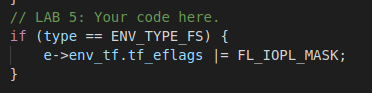

当创建环境时，我们判断环境的类型，如果是文件系统环境则更改其EFLAGS寄存器的IOPL位。

### Exercise 2

在 `fs/bc.c` 中实现 `bc_pgfault` 和 `flush_block` 函数。

#### bc_pgfault()

`bc_pgfault` 函数是一个页故障服务程序，它的任务是从磁盘中加载页去响应一个页故障。在你编写它时，记住： (1) `addr` 可能并不会做边界对齐，并且 (2) 在扇区中的 `ide_read` 操作并不是以块为单位的。

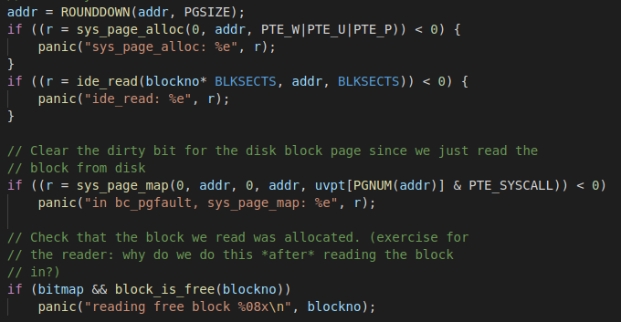

#### flush_block()

函数 `flush_block` 会将一个块写入到磁盘上。如果在块缓存中没有块（也就是说，页没有映射）或者它不是一个脏块，那么 `flush_block` 将什么都不做。我们将使用虚拟内存硬件去跟踪，磁盘块自最后一次从磁盘读取或写入到磁盘之后是否被修改过。查看一个块是否需要写入时，我们只需要去查看 `uvpt` 条目中的 `PTE_D` 的 ”dirty“ 位即可。块被写入到磁盘上之后，`flush_block` 函数将使用 `sys_page_map` 去清除 `PTE_D` 位。

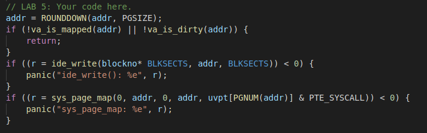

### Exercise 3

使用 `free_block` 作为实现 `fs/fs.c` 中的 `alloc_block` 的一个模型，它将在位图中去查找一个空闲的磁盘块，并将它标记为已使用，然后返回块编号。当你分配一个块时，你应该立即使用 `flush_block` 将已改变的位图块刷新到磁盘上，以确保文件系统的一致性。

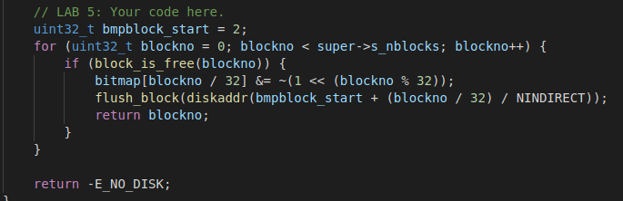

### Exercise 4

实现 `file_block_walk` 和 `file_get_block`。

#### file_block_walk()

`file_block_walk` 从一个文件中的块偏移量映射到 `struct File` 中那个块的指针上或间接块上，它非常类似于 `pgdir_walk` 在页表上所做的事。

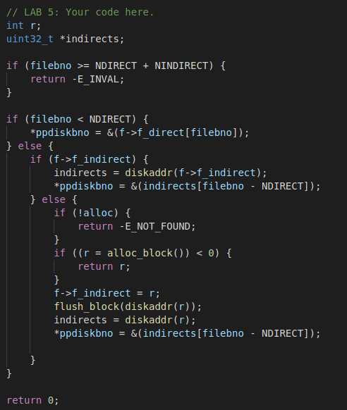

#### file_get_block()

`file_get_block` 将更进一步，将去映射一个真实的磁盘块，如果需要的话，去分配一个新的磁盘块。

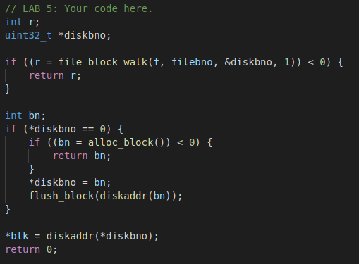

### Exercise 5

实现 `fs/serv.c` 中的 `serve_read`。

`serve_read` 的重任将由已经在 `fs/fs.c` 中实现的 `file_read` 来承担（它实际上不过是对 `file_get_block` 的一连串调用）。对于文件读取，`serve_read` 只能提供 RPC 接口。

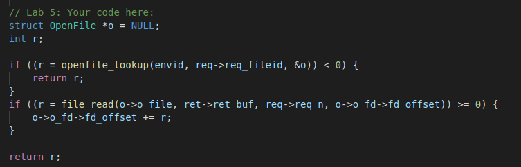

### Exercise 6

实现 `fs/serv.c` 中的 `serve_write` 和 `lib/file.c` 中的 `devfile_write`。

#### serve_write()

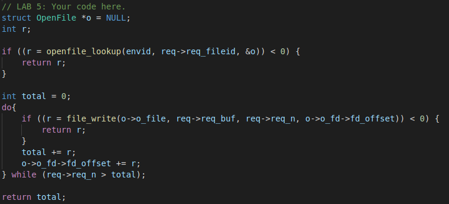

#### devfile_write()

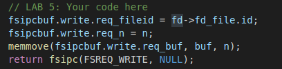

### Exercise 7

`spawn` 依赖新的系统调用 `sys_env_set_trapframe` 去初始化新创建的环境的状态。

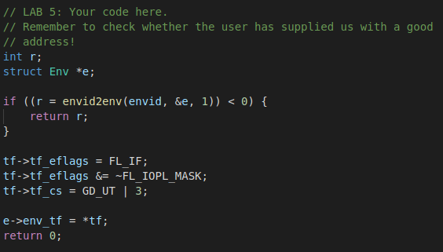

### Exercise 10

为 `<` 在 `user/sh.c` 中添加重定向的功能。

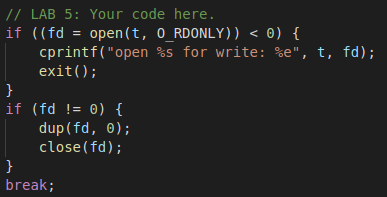

### 运行测试

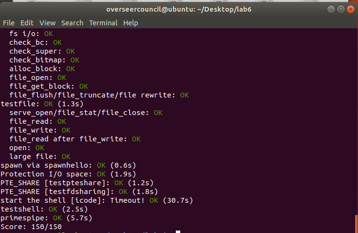


## 问题回答

### Question 1

*当你从一个环境切换到另一个环境时，你是否需要做一些操作来确保 I/O 权限设置能被保存和正确地恢复？为什么？*

不需要，因为切换环境时陷入中断后，寄存器会自动保存到对应env的env_tf域中，这一机制我们在之前的lab中已经实现了。

### 详细描述JOS 中文件存储的结构、打开文件的过程以及往文件中写入数据的过程。

#### 文件存储结构

JOS的文件系统不使用inodes，所有文件的元数据都被存储在directory entry中。文件和目录逻辑上都是由一系列数据blocks组成，这些blocks分散在磁盘中，文件系统屏蔽blocks分布的细节，提供一个可以顺序读写文件的接口。

大部分磁盘都是以Sector为粒度进行读写，JOS中Sectors为512字节。而文件系统则以block为单位分配和使用磁盘，JOS的的block size被定为4096字节。

文件系统使用一些特殊的block保存文件系统属性元数据，比如block size, disk size, 根目录位置等。这些特殊的block叫做superblocks。JOS的文件系统使用一个superblock，位于磁盘的block 1。block 0被用来保存boot loader和分区表。

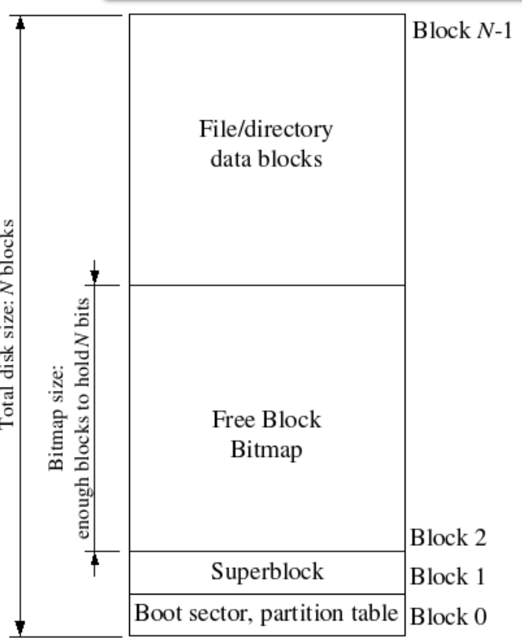

我们的文件系统使用struct File结构描述文件，该结构包含文件名，大小，类型，保存文件内容的block号。struct File结构的f_direct数组保存前NDIRECT(10)个block号，这样对于10*4096=40KB的文件不需要额外的空间来记录内容block号。对于更大的文件我们分配一个额外的block来保存4096/4=1024 block号。所以我们的文件系统允许文件最多拥有1034个block。File结构如下：


File结构既能代表文件也能代表目录，由type字段区分，文件系统以相同的方式管理文件和目录，只是目录文件的内容是一系列File结构，这些File结构描述了在该目录下的文件或者子目录。
超级块中包含一个File结构，代表文件系统的根目录。

#### 打开文件的过程

用户进程通过进程间通信机制向文件系统(FS)进程发送一个请求。FS进程收到请求后，从磁盘取出一个File，将其存进内存中，并且分配一个OpenFile结构给其，并将该结构的起始地址返回给用户进程。

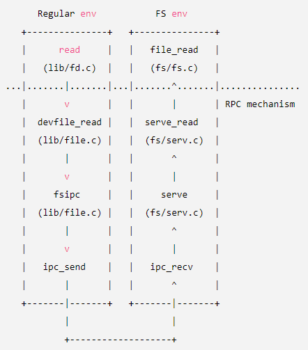

#### 向文件写入数据的过程

和打开文件的过程类似。

### 对于此JOS，一个磁盘有多少个扇区？

jos可以映射最大为3GB的磁盘，磁盘的每个扇区大小为512个字节。

所以单个磁盘扇区数为3×1024×1024×2个扇区。

### 请详细阐述，JOS中superblock的概念，以及superblock的布局和结构。

文件系统一般在磁盘上的“易于查找”的位置（比如磁盘开始或结束的位置）保留一些磁盘块，用于保存描述整个文件系统属性的元数据，比如块大小、磁盘大小、用于查找根目录的任何元数据、文件系统最后一次挂载的时间、文件系统最后一次错误检查的时间等等。这些特定的块被称为超级块。

在JOS中，我们只有一个超级块，固定为磁盘的1号块，布局定义在 `inc/fs.h` 文件里的 `struct Super` 中。

```
struct Super {
    uint32_t s_magic;       // Magic number: FS_MAGIC
    uint32_t s_nblocks;     // Total number of blocks on disk
    struct File s_root;     // Root directory node
};
```

### 问题5

以open文件为例，阐述regular环境访问磁盘的流程；画出对应的流程图；fd page是什么时候设置好的？

%E5%8E%9F%E7%90%86.png)

同上述打开文件的过程，其中涉及到FS进程的虚拟内存地址和磁盘块的对应。


fd page是在fs进程从虚拟内存（也即磁盘）中读到文件并为其分配fd描述符时设置的。